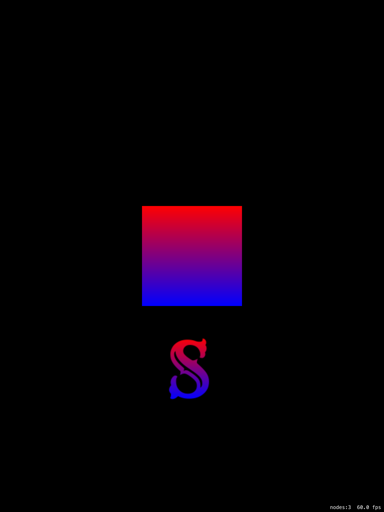

# SpriteKit Shaders
Example of how to put a gradient or outline over a sprite in SpriteKit.

## Gradient Shader Source

The executive summary: create a file called Gradient.fsh and add this source to it:

    void main() {
        vec4 color = texture2D(u_texture, v_tex_coord);
        gl_FragColor = color * vec4(mix(bottomColor, topColor, v_tex_coord.y));
    }
    
Then just set it on to your `SKSpriteNode` object:

    override func didMoveToView(view: SKView)
    {
        let letterS = childNodeWithName("LetterS") as! SKSpriteNode
        let shader = SKShader(fileNamed: "Gradient.fsh")
        let topColor = SKColor.redColor()
        let bottomColor = SKColor.blueColor()
        let uniforms = [
            SKUniform(name: "topColor", floatVector4: topColor.vec4()),
            SKUniform(name: "bottomColor", floatVector4: bottomColor.vec4())
        ]
        shader.uniforms = uniforms
        letterS.shader = shader
    }

That's it.  

## Outline Shader Source

Bit more complex `Outline.fsh`:

    void main(void) {
        vec4 color = texture2D(u_texture, v_tex_coord);
    
        float alpha = color.a;
        vec2 texturePos = v_tex_coord.xy;
        vec2 ss = u_step_size;
        float diff0 = abs(alpha - texture2D( u_texture, texturePos + vec2( ss.x, 0.0 ) ).a);
        float diff1 = abs(alpha - texture2D( u_texture, texturePos + vec2( -ss.x, 0.0 ) ).a);
        float diff2 = abs(alpha - texture2D( u_texture, texturePos + vec2( 0.0, ss.y ) ).a);
        float diff3 = abs(alpha - texture2D( u_texture, texturePos + vec2( 0.0, -ss.y ) ).a);
        alpha = max(max(diff0, diff1), max(diff2, diff3));

        // return a pre-multiplied value for frag color
        gl_FragColor = color + vec4(u_color.rgb * alpha, alpha);
    }  
    
Then just set it on to your `SKSpriteNode` object:

    let spriteSize = mySprite.size
    let outlineWidth = 2.0
    let stepSize = GLKVector2Make(Float(outlineWidth/spriteSize.width), 
                                  Float(outlineWidth/spriteSize.height))
    let outlineShader = SKShader(fileNamed: "Outline.fsh")
    let outlineColor = SKColor.cyanColor()
    let uniforms2 = [
        SKUniform(name: "u_step_size", floatVector2: stepSize),
        SKUniform(name: "u_color", floatVector4: outlineColor.vec4())
    ]
    outlineShader.uniforms = uniforms2
    mySprite.shader = outlineShader

## Limitations

For performance reasons the outline shader avoids all loops and conditionals.  As a result it only takes 4 samples for the convolution.  This does cause some artifacts (double-line appearance in the brown cape monster).  You can experiment with the outlineWidth to try to reduce this.

## SpriteKit Shader Gotcha's

There is a lot of magic going on with [SpriteKit's SKShader class](https://developer.apple.com/library/prerelease/ios/documentation/SpriteKit/Reference/SKShader_Ref/index.html#//apple_ref/doc/uid/TP40014286-CH1-SW2).  Under the hood your shader source is actually composited into a function which is called by the real fragment shader.  That shader is different on desktop and devices, and is also different on Metal & non-Metal devices.  

Apple have tried to wall-paper over these differences by using some magic functions and variables, but at least as of now (Mar 2016) there are [bugs on some platforms](https://forums.developer.apple.com/thread/4035) which still aren't fixed.

* On Metal SKDefaultShading() is not defined so use a work-around:

    `vec4 color = v_color_mix * texture2D(u_texture, v_tex_coord);`

* Textures coming from an atlas (they should be) [are pre-multiplied alpha]().

    `v_color_mix`
    
* The texture output gl_FragColor MUST be pre-multiplied alpha

* Even if you pad your textures with clear pixels you won't be able to avoid artifacts at the edges (top of wings of bat minion).
    
